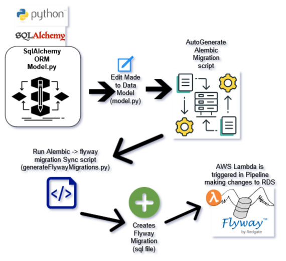

# Contents:

* [Quickstart - Migrations](#tldr-migrations---how-to)
* [Alembic Help](#alembic-stuff)
   * [Alembic - Create new Migration](#generate-a-new-alembic-migration-based-on-changes-to-the-modelpy)
   * [Alembic - Generate Blank Migration](#generate-blank-migration-file-for-future-population)
   * [Alembic - How to inserts](#alembic---how-to-inserts)
   * [Alembic - Run All Migrations](#alembic---run-all-migrations)
   * [Alembic - Offline migration, generate SQL](#alembic---convert-alembic-migration-to-sql)
   * [Alembic - View history]()
* [Local Database Setup](#local-database-setup-containerized)
  * [DB - Reset Database](#db---reset-database)
  * [Local Flyway Install](#local-flyway-install)


# TLDR: Migrations - How to



1. Init a database
    ```
    cd server/backend
    docker-compose up db
    ```
1. Run the existing migrations to bring database up to date
    ```
    cd api
    alembic upgrade head
    ```
1. Make changes in the orm database definition `model.py`

1. **_Before_** you push to remote and request a PR, create and alembic migration
    ```
    # from the server/backend/api directory...
    alembic revision --autogenerate -m "migration message"
    ```

1. Review the autogeneratated migration to make sure it makes sense.  Should be
   located in `server/backend/api/alembic/versions`.  Look for the most recent
   version tag that aligns with the migration message you supplied in the
   previous command.

1. If looks good generate the flyway migration
   ```
   cd server/backend/api/alembic
   python3 generateFlywayMigrations.py
   ```

1. Review the flyway migration file.  Should be in the directory
   `server/flyway/sql`

1. Now and only now Push and create your PR.  The pipeline will pickup the
   flyway migrations.


# Alembic Stuff

## Alembic - Create new Migration

Looks at the local database and the orm `model.py`.  Does its best to create a
migration based on autodetected differences.
[more on autogen, what it will and won't do](https://alembic.sqlalchemy.org/en/latest/autogenerate.html)

```
cd server/backend/api
alembic revision --autogenerate -m "migration message"
```

**Note:** After `sqlacodegen` has been used to reverse engineer the database
 into an ORM, you can turn the changes into a migration using the command
 above.


## Alembic - Generate Blank Migration

```
cd server/backend/api
alembic revision -m "migration message"
```

after the migration file has been generated you would go into the migration file
and define your own migration.

## Alembic - How to inserts

* see steps above to generate a new migration file
* now open the migration file and add lines like the following to add new
  data in the migration under the `upgrade` method:

  ``` python
    famApp = app.models.model.FamApplication.__table__
    op.bulk_insert(famApp,
        [
            {'application_name': 'fam',
            'application_description': 'Forests Access Management',
            'create_user': 'fam_proxy_api',
            'update_user': 'fam_proxy_api'
            },
            {'application_name': 'fom',
            'application_description': 'Forest Operations Map',
            'create_user': 'fam_proxy_api',
            'update_user': 'fam_proxy_api'
            }
        ]
    )
   ```

   if you want to be able to support rollbacks then define statements in the
   downgrade to remove the records.


## Alembic - Run All migrations

Having generated a new alembic migration, you can then apply it:
```
cd server/backend/api
alembic upgrade head
```

## Alembic - Convert Alembic migration to SQL

The script located in `server/backend/api/alebic` called `generateFlywayMigrations.py`
is what should be used to create the flyway migrations, one of the steps that
the script executes is described below.

Create sql for everything up to V2:

`alembic upgrade V2 --sql > {flyway migration file}`

Create sql for only V2:

`alembic upgrade V1:V2 --sql > {flyway migration file}`

## Alembic - view history

`alembic history`

---

# Local Database Setup (containerized)

For local development, a docker-compose file has been created in `server/backend`
that spins up a postgres database that will back the api.


## DB - Reset database

Find the database volume:
`docker volume ls`

Delete the database volume
`docker volume rm backend_db`

if error like this shows up:
`Error response from daemon: remove backend_db: volume is in use - [1e14af6c71d6c803a27e32525b43c0bc3f360a8ca176473461ca938f6b66ada2]`

then stop and remove the container and then delete the volume:

```
docker container stop <container id>
docker container rm <container id>
docker volume rm backend_db
```

## Local Flyway Install

Assuming you are running WSL, the following command should install flyway for
you.

```
wget -qO- https://repo1.maven.org/maven2/org/flywaydb/flyway-commandline/9.0.1/flyway-commandline-9.0.1-linux-x64.tar.gz | tar xvz && sudo ln -s `pwd`/flyway-9.0.1/flyway /usr/local/bin`
```

